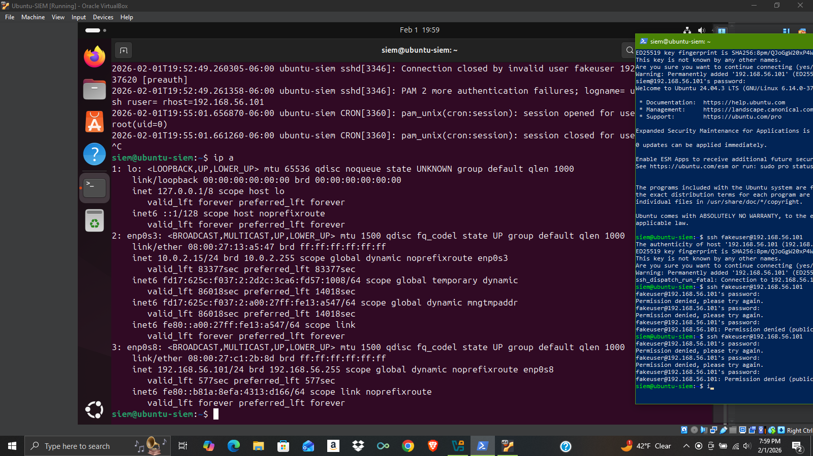

# Ubuntu SSH Attack Detection Lab (SIEM Fundamentals)

## Overview

This lab demonstrates a simulated SSH brute-force / invalid-user attack against an Ubuntu Linux system and the detection of that activity through native Linux authentication logs. The purpose of this project is to showcase hands-on SOC-relevant skills including system configuration, log analysis, network troubleshooting, and incident-style investigation.

This project was built to mirror how a security analyst would observe, validate, and explain suspicious authentication activity in a real environment.

---

## Lab Architecture

**Host System (Attacker Simulation)**

* Windows 10
* Windows PowerShell
* OpenSSH client

**Target System (Monitored Host)**

* Ubuntu 24.04.3 LTS
* OpenSSH Server (`sshd`)
* Authentication logging via `/var/log/auth.log`

**Virtualization Platform**

* Oracle VirtualBox

**Network Configuration**

* Adapter 1: NAT (internet access)
* Adapter 2: Host-only network (`192.168.56.0/24`)

This configuration allows direct SSH traffic between the Windows host and the Ubuntu VM while remaining isolated from external networks.

---

## Objectives

* Configure an Ubuntu VM with SSH access
* Simulate unauthorized SSH login attempts from a Windows host
* Capture and analyze authentication failures
* Identify attacker IP, username, and failure patterns
* Validate findings using system logs

---

## Attack Simulation

From the Windows host, repeated SSH login attempts were made using a non-existent account:

```
ssh fakeuser@192.168.56.101
```

The attempts resulted in repeated authentication failures and eventual connection termination.
---

## Detection & Analysis

On the Ubuntu system, authentication logs were reviewed using:

```
sudo tail -f /var/log/auth.log
```

Observed log entries included:

* `Invalid user fakeuser`
* `Failed password for invalid user fakeuser`
* `pam_unix(sshd:auth): authentication failure`
* Source IP address: `192.168.56.101`
* Service: `sshd`

These entries confirm unsuccessful SSH authentication attempts originating from the Windows host.
---

## Network Validation

Network interfaces were verified using:

```
ip a
```

Key findings:

* `enp0s3` → NAT interface (`10.0.2.15`)
* `enp0s8` → Host-only interface (`192.168.56.101`)

This confirms that the SSH traffic observed in the logs originated from the host-only network.
---

## Key Security Concepts Demonstrated

* SSH authentication mechanisms
* Linux authentication logging
* Host-based detection
* Network segmentation (NAT vs Host-only)
* Incident-style log analysis

---

## Why This Lab Matters

This project demonstrates practical security monitoring skills beyond theoretical knowledge. It reflects real-world SOC workflows such as:

* Identifying unauthorized access attempts
* Correlating logs with network activity
* Explaining findings in clear, professional language

---

## Possible Extensions

* Implement account lockout or Fail2Ban
* Forward logs to a SIEM (Splunk / Elastic)
* Write a Python script to parse SSH failures
* Simulate successful authentication and compare logs

---

## Screenshots

Screenshots included in this repository show:

* SSH attack attempts from Windows PowerShell
* 
* Corresponding authentication failures in Ubuntu logs
* 
* Network interface configuration confirming IP addresses
* 

---

## Author

Patrick Guidry
Aspiring SOC / Cybersecurity Analyst

---

*This lab was created for educational and portfolio purposes.*
